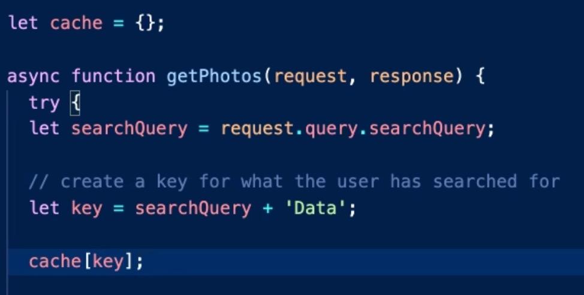
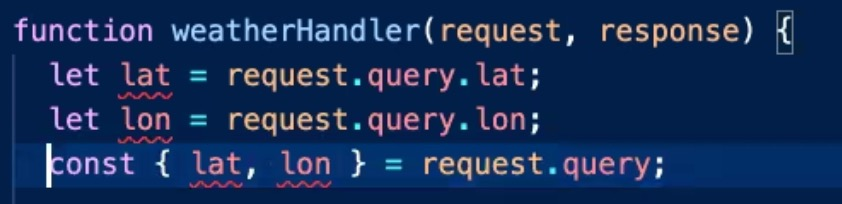
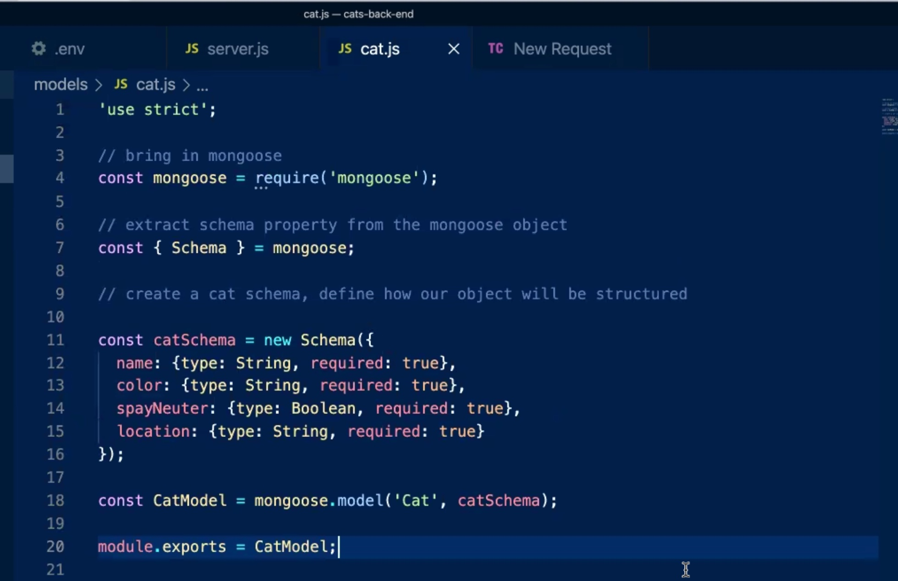

# 301d83 Lecture Times
Instructor **Sheyna Watkins**

|Class #|Times|Links|
|---|---|---
|**3/14/2022 - Class 01: Introductions and intro to React**|<ul>10:39 Review 10:45 class vs constructor 11:10 data structures and algorithms 11:18 forEach **11:23 Lecture** 11:24 react 11:28 NPM 11:30 Node version 11:34 Favicon browser tab image 11:35 Live Server 11:38 stop server 11:41 Deployment 11:42 Create a new repo for React 11:42 Netlifly 11:57 jsx 11:58 fracs or fractional elements 12:02 Lab01 overview</ul>|<ol><li>Netlify https://www.netlify.com/</li><li>React https://reactjs.org/</li><li></li><li></li></ol>
|**3/15/2022 - Class 02: React state and Bootstrap**|<ul>9:10 warm up 9:18 code_challenge01 review  9:35 Lab01 Review  10:20 code_challenge02 Review 10:24 Repl example for MAP() **10:31 Lecture** 10:37 Json 10:40 for Each 10:52 Props (state)     11:00 event listener 11:22 CSS 11:25 FLEXBOX 11:40 REACT BOOSTRAP 11:43 BOOSTRAP use version 11:58 Ternary   12:20 Heart Icon</ul>|<ol><li>React Bootstrap https://react-bootstrap.github.io/</li><li>Emoji Finder https://emojifinder.com/</li><li></li><li></li></ol>|
|**3/16/2022 - Class 03: Passing state and functions as props**|<ul>9:19 warm up 9:28 code_challenge02 review 9:40 lab02 review 9:47 beast 10:05 `` 10:07 bootstrap cards 10:09 react boostrap discussion 10:18 inline styling **10:32 Lecture** 10:57 Lab03 overview 10:58 modal 11:20 Modal live example 11:55 code_challenge03 overview </ul>|<ol><li>Bootstrap CheatSheet https://hackerthemes.com/bootstrap-cheatsheet/</li><li>Modal https://react-bootstrap.github.io/components/modal/</li><li></li><li></li></ol>|
|**3/17/2022 - Class 04: Forms in React**|<ul>9:05 warm up 9:22 code_challenge03 review  9:30 lab03 review 9:33 instructor diagram overview **Lecture** 10:30 Forms in React 11:29 submitting forms 11:48 Bootstrap <ol>1. install components </ol><ol>2. import component we want to use </ol><ol>3. import minify styles</ol>12:02 code_challenge04 overview 12:03 array.prototype.sort() 12:15 Lab04 overview </ul>|<ol><li></li><li></li><li></li><li></li></ol>|
|**3/18/2022 - Class 05: WRRC and reduce**|<ul>9:07 warmup 9:19 code_challenge04 review 9:37 Lab04 review **10:31 Lecture** 10:34 API, WRRC 10:41 city explorer setup 10:55 form 11:05 asynchronous 11:08 prevent default 11:23 code_challenge05 overview 11:59 Lab05 overview</ul>|<ol><li></li><li></li><li></li><li></li></ol>|
|**3/21/2022 - Class 06:  API request from the front end, axios, env variables** |<ul>9:03 warmup 9:09 Code Review 9:26 Lab05 review 9:42 caniuse.com css grid 9:51 AboutMe adding additional pages 9:55 content agnostic 10:08 Lab06 Ovewrview 10:10 WWRC 10:16 Rest 10:20 anatomy of a URL  10:27 API 10:31 Axios 10:32 install axios 11:06 Location IQ (API keys) 11:15 .env file 11:43 get data from API  11:48 restart server when you process .env files 11:52 Lab06 overview 11:55 Trello 12:06 sample.env 12:07 error handling `try{} catch(error){}`  12:18 deployment 12:22 partner work WRRC 12:26 code_challenge06 overview 12:28 pass by value pass by reference 12:32 spread operator </ul>|<ol><li>Axios https://www.npmjs.com/package/axios</li><li>LocationIQ https://locationiq.com/</li><li>Trello https://trello.com/home</li><li>Error codes https://httpstatusdogs.com/</li></ol>|
|**3/22/2022 - Class 07: Building a server and connecting it to your front** | <ul>9:07 warmup 9:23 code_challenge06 9:28 Lab06 review-tai lab 9:40 anatomy of URL 9:43 error handlingv 10:26 abdi lab review 10:36 roger lab review 10:41 Lecture 10:43 node  node lets us use javascript on backend 10:52 npm init 10:56 eslint and gitignore copy 11:03 background color for server js  11:26 npm kill port 11:39 routes REST  11:43 request route 12:07 find 12:20 heroku 12:28 lab07 overview   12:32 Weather Data overview (json file) 12:34 Front end linked up to back end 12:41 Axios handle submit 12:44 Local location of server (.env) 12:48 BLOCKED BY CORS  12:54 Error Handling in server.js</ul>|<ol><li>Heroku https://www.heroku.com/</li><li></li><li></li><li></li></ol>|
|**3/23/2022 - Class 08:Making an API call from our server Afternoon: Lab 08 intro and intro to RegEx**| <ul>9:08 code_challenge07 review 9:21 lab07 review 9:08 code_challenge07 review 9:21 lab07 review 9:51 Data query from Json file explanation  9:57 difference between find and filter  10:11 error handling 10:15 front end error handling 10:34 lecture 10:37 connecting front end to back end  10:53 image finder back end 11:01 workbench color fix in json file. 11:03 start server. 11:13 axios 11:15 unsplash api  11:19 api version and authorization 11:21 thunderclient add to VS code  11:31 route using thunderclient 10:48 API request to unsplash axios 11:58 JSON cleanup -> error message 1:15 Front end error handling 1:25 Heroku deployment for front end 1:28 Heroku add API keys before deploy 1:31 push from main onto main 1:33 edit enviormental variables netlify = deployed link from Heroku w/o final slash 1:38 Lab08 Overview 1:40 weatherbit api 1:43 thunderclient weather API 1:47 movie api - use version 3 of documentation. Use movies with city name from query  1:51 Movie API - how to use images 1:52 Lizzy Regex intro  2:21 code_challenge example</ul>|<ol><li>React Bootstrap Alerts https://react-bootstrap.github.io/components/alerts/?</li>JSON Chrome Formatter https://chrome.google.com/webstore/detail/json-formatter/bcjindcccaagfpapjjmafapmmgkkhgoa?hl=en<li>Unsplash https://unsplash.com/developers</li><li></li><li></li></ol>|
|**3/24/2022 - Class 09:**| <ul>9:13 code_challenge08 review 9:40 code_challange09 overview 9:45 Lab08 Review 11:29 Lecture refactoring code 11:50 Photos.js 11:52 import/export 12:00 Error Handling (Promise.resolve().then.()=>{throw new Error(error.message)}) 12:05 passing URL  12:09 Lab09 lab effort </ul>|<ol><li></li><li></li><li></li><li></li></ol>|
|**3/25/2022 - Class 10:**| <ul>9:05 code_challenge09 review(4,6) 9:33 code review (dwight) 10:21 Next week Overview 10:33 code_challenge10 overview 10:35 for in loop 10:38 Lecture (cache)  10:55 if else 10:57 datenow() milli seconds since Jan 1 1970 11:38 lab10 overvew **dont do strech goal**</li></ul>|<ol><li></li><li></li><li></li><li></li></ol>|

|**3/28/2022 - Class 11:**| <ul>9:03 mongoDB 
9:11 code_challenge10  
9:20 lab10 review (Roger) 
9:33 object desconstruction 
 
9:43 promise 
9:54 Lecture 
9:55 split and join  
 
10:06 lab11 overview 
10:07 CRUD = CREATE READ UPDATE DELETE 
Mongo and Mongoose 
10:08 SQL  
10:09 relational databases 
10:10 non relational DB = JSON data 
Can use a ODM Object Document Mapping gives us a way to map out. a structure of what our data looks like. => Mongoose
ORM object relational Mapping 
Mongoose an ODM gives us the ability to create data models that use a specific scheme. Will allow a non relational database to act like a relational db using JS. 
10:31 Code example 
10:36 mongoose 
10:43 **explanation of relational vs non relational db 
### cat.js 
 
### server.js 
 
### .env 
 
 
11:16 adding data to db seeding data 
CRUD CREATE
## seed.js 
 
11:27 ***CRUD*** 
READ using GET 
 
 
 
 
you can be specific to request 
if statement to 
 
11:43 connect front end
 
MAPPING DATA FROM STATE
 
ADD KEY 
 
11:46 update state 
11:48 REACT component 
componentDidMount() 
 
11:51 to lowercase in serverjs 
11:51 Lab Trello board => make public 
create a plan for hours to work, cooperative strategy, conflict resolution in place 
same partner all week 
<ol><li>
to do's in the code files too</li><li>trello board</li><li>assignment lab page</li></ol>
12:00 authentication
12:02 carousel
 
12:05 do not do code challenge do basic (30mins) 
try atleast 4 hours for lab
</ul>|<ol><li>MongoDB 
https://www.mongodb.com/atlas/database</li><li></li><li></li><li></li></ol>|

|**3/29/2022 - Class 12: PUT and DELETE**| <ul>9:03 assessment and week info
9:13 code_challenge11 review
9:29 lab11 review
10:14 refactor
10:38 code_challenge12  regex2
10:43 Lecture
10:48 CRUD
10:56 iterating through Cats
11:00 two components inside one file
11:20 middleware
11:25 CRUD delete
11:35 findByIdAndDelete
11:50 wire up front end</ul>|<ol><li>regex101.com</li><li>https://expressjs.com/en/guide/routing.html</li><li></li><li></li></ol>|

|**3/30/2022 - Class 13:**| <ul></ul>|<ol><li></li><li></li><li></li><li></li></ol>|

|**3/31/2022 - Class 14:**| <ul></ul>|<ol><li></li><li></li><li></li><li></li></ol>|

|**4/1/2022 - Class 15:**| <ul></ul>|<ol><li></li><li></li><li></li><li></li></ol>|

---
### [Home](https://github.com/MISalz/301_Reading_Notes)